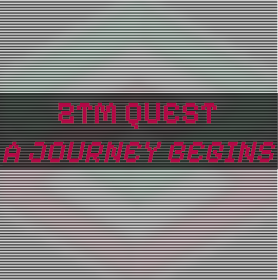

# ZTM Quest - A Journey Begins

<p align="center">
  
</p>

Whether you're an experienced game developer, a Javascript expert, an HTML and CSS pro, or a beginner who has never worked with any of these, this project is designed for anyone who is interested in creating something new and special. The core languages used in this project are Javascript, HTML, and CSS, enhanced with the magic of kaplay.js (formerly kaboom.js). However, even if you're not familiar with Javascript, you can still contribute by submitting non-code pull requests. We also need game assets like spritesheets, music, or even ideas in the form of a screenplay, which will serve as a guide for developers to create assets that align with the project's vision.

Let's see how far we can get and where the game will lead to.

## Rules

Here are some rules regarding contributions (especially during Hacktoberfest). 
- No competitions about who resolves issues first or who fixes a pull request first. Helping each other is good and important, but creating pressure doesn't help.
- Fixing just one typo per pull request is not really considered adding a lot of value. Make sure you add real value by contributing to the game itself with logic, assets, or screenplays.
- We know that everyone wants their pull request merged as soon as possible. However, please remember this is an open source project and each person who works on it does so in their freetime. This includes the maintainers!
- If a pull request got reviewed and problems were found, we will reject it first and request changes as long as the pull request is valid. No need to panic here. Just something which is common practice.
- If you add game assets or entire new maps to the game, make sure to keep track of any credits and shout-outs which we have to make for third-party resources. Altough they might be free to use, it is more than fair to give creative artists credit for their work. Even if it is a self-made asset, add yourself to the [asset_credits](./asset_credits.md) file.


## How to Get Started

### Forking & Cloning the repository

Forking the repository is as easy as hitting the fork button in this repo.
After the fork process, you can then 

```bash
git clone https://github.com/<your-username>/ZTM-Quest.git
```

Or even better if you have set up SSH for your github account with
```bash
git clone git@github.com:<your-username>/ZTM-Quest.git
```

After cloning it, you have to set up the upstream to be able to sync your local repository with the current version of this repository by running
```bash
cd ZTM-Quest
git remote add upstream git@github.com:zero-to-mastery/ZTM-Quest.git
```

Each time you start working, you should run
```bash
git pull upstream main
```

You should run this in order to get the latest code and avoid merge conflicts in advance.

### Setting Up the Project Itself

You should already be in the ZTM-Quest directory. If not, just cd into it by running
```bash
cd ZTM-Quest
```
Make sure you use the entire path where you have cloned it into.
Inside run
```bash
npm install
```

This should set everything up and you should be good to go.


### Scripts
You can run the dev server with hot module reloading with

```bash
npm run dev
```

Run code style checks
```bash
npm run prettier
```

Run code style fix
```bash
npm run prettier:fix
```

Run linting
```bash
npm run lint
```

### Additional Information

One of the tasks will be to add interactions in the ZTM Quest world. In order to help contributors identify objects in a map, screenshots were made from the [Tiled](https://www.mapeditor.org/) software with available objects with their corresponding names.
If you want to develop interactions, be sure to check out the [additional-map-info readme](./additional-map-info/Readme.md)

### How-To Guides

Since it can be really confusing how to start contributing, we have added two HOW-TOs to help you out and make things easier.

[How-To add game objects](./HOWTO_Add-Game-Objects.md)

[How-To add interactions](./HOWTO_Add-Interactions.md)

## Recommendations for Creating New Assets (Not Mandatory to Contribute)

Here are some tools which I would recommend regarding game asset creation from scratch.

- For map creation: [Tiled](https://www.mapeditor.org/)
- For music creation: [CakeWalk](https://www.bandlab.com/products/cakewalk) (even a mobile app is available)
- For art creation: [Gimp](https://www.gimp.org/) 
