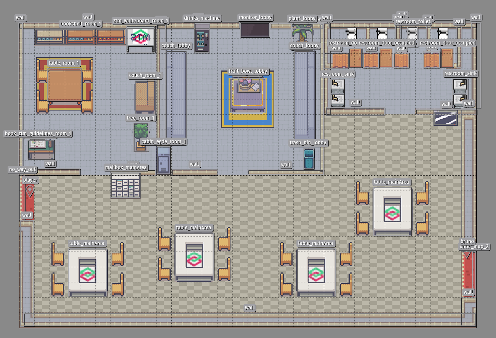
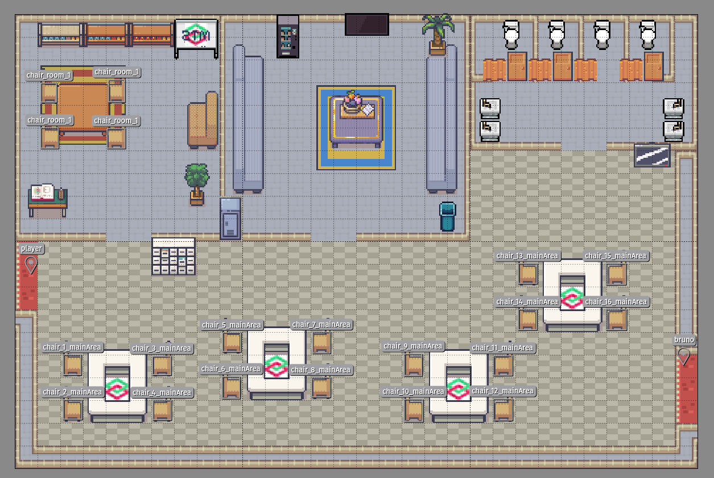
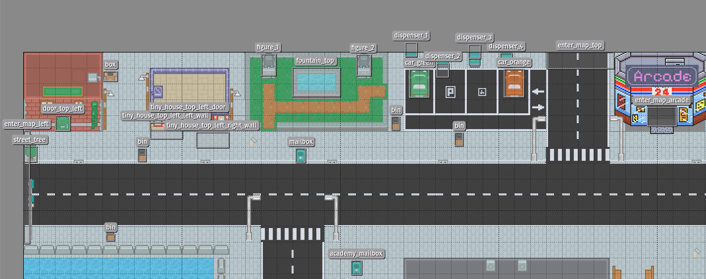
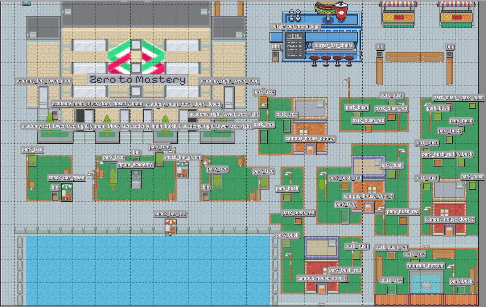
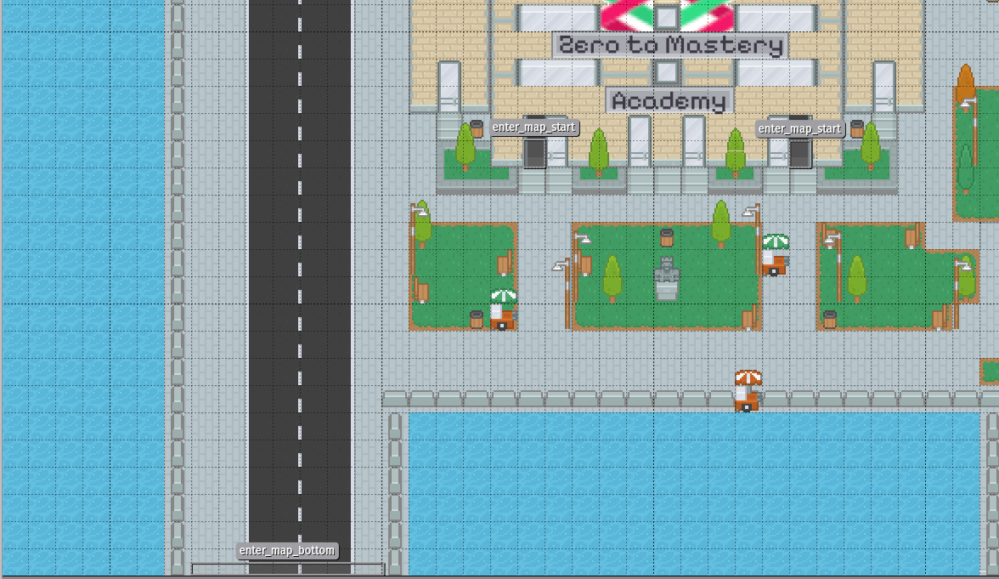
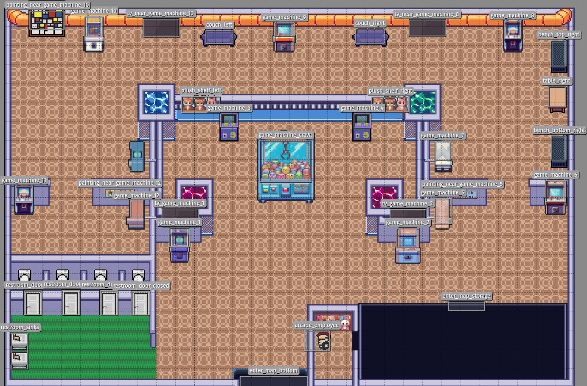

# Side Notes and infos about maps

In order to make interactions for specific maps, this folder contains screenshots from [Tiled](https://www.mapeditor.org/) to help you identifiy object boundaries for adding interactions.
The name which is displayed above each available object is also the identifier in the [Tiled](https://www.mapeditor.org/) map export json which you can find for example [here](../public/maps/map_start.json).

With each added map, you will also find object screenshots to identify objects which you might want to create interactions with.

## Start map (map_start)

## City (map_city)

## Arcade (map_arcade)

