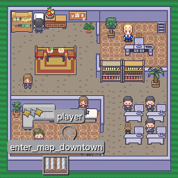

# Side Notes and infos about maps

In order to make interactions for specific maps, this folder contains screenshots from [Tiled](https://www.mapeditor.org/) to help you identifiy object boundaries for adding interactions.
The name which is displayed above each available object is also the identifier in the [Tiled](https://www.mapeditor.org/) map export json which you can find for example [here](../public/maps/map_start.json).

With each added map, you will also find object screenshots to identify objects which you might want to create interactions with.

## Start map (map_start)

<figure>
    
    <figcaption>Interactive Objects</figcaption>
</figure>

<figure>
    
    <figcaption>Chair Objects</figcaption>
</figure>

## City (map_city)

<figure>
    
    <figcaption>Section 1 Objects</figcaption>
</figure>
<figure>
    
    <figcaption>Section 2 Objects</figcaption>
</figure>
<figure>
    
    <figcaption>Section 3 Objects</figcaption>
</figure>
<figure>
    
    <figcaption>Section 4 Objects</figcaption>
</figure>

## Arcade (map_arcade)

<figure>
    
    <figcaption>Interactive Objects</figcaption>
</figure>

## Forest (map_forest)

<figure>
    
    <figcaption>Interactive Objects</figcaption>
</figure>
<figure>
    
    <figcaption>Building Boundaries</figcaption>
</figure>
<figure>
    
    <figcaption>Map Boundaries</figcaption>
</figure>
<figure>
    
    <figcaption>Enter Map Boundaries</figcaption>
</figure>
<figure>
    
    <figcaption>Spawn Points</figcaption>
</figure>

## Forest Junction (map_forest_junction)

<figure>
    
    <figcaption>Interactive Objects</figcaption>
</figure>
<figure>
    
    <figcaption>Building Boundaries</figcaption>
</figure>
<figure>
    
    <figcaption>Map Boundaries</figcaption>
</figure>
<figure>
    
    <figcaption>Enter Map Boundaries</figcaption>
</figure>
<figure>
    
    <figcaption>Spawn Points</figcaption>
</figure>

## Player House (map_campus_house_1)
<figure>
    
    <figcaption>Interactive Objects</figcaption>
</figure>

## Classroom (map_classroom)
<figure>
    
    <figcaption>Interactive Objects</figcaption>
</figure>
<figure>
    
    <figcaption>Spawnpoints</figcaption>
</figure>

## Downtown (map_downtown)
<figure>
    
    <figcaption>Interactive Objects</figcaption>
</figure>
<figure>
    
    <figcaption>Spawnpoints</figcaption>
</figure>
<figure>
    
    <figcaption>Spawnpoints</figcaption>
</figure>

## Extended Campus (map_campus)
<figure>
    
    <figcaption>Interactive Objects</figcaption>
</figure>
<figure>
    
    <figcaption>Spawnpoints</figcaption>
</figure>

## Orange House (map_orange_house)
<figure>
    
    <figcaption>Interactive Objects</figcaption>
</figure>

## Realtor (map_realtor)
<figure>
    
    <figcaption>Interactive Objects</figcaption>
</figure>

## Seaside (map_seaside)
<figure>
    
    <figcaption>Interactive Objects</figcaption>
</figure>

## Company Interior (map_interior)
<figure>
    
    <figcaption>Interactive Objects</figcaption>
</figure>
<figure>
    
    <figcaption>Spawnpoints</figcaption>
</figure>